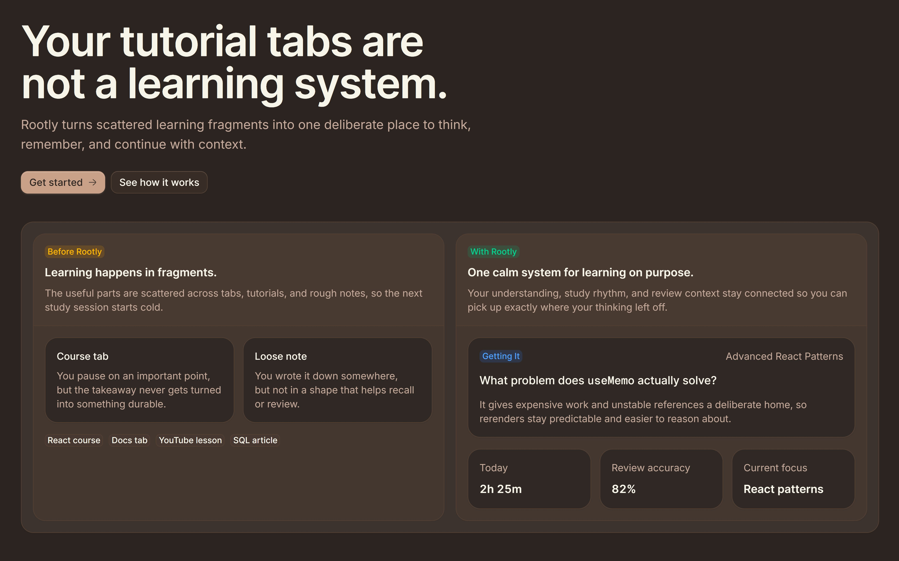

# Rootly



Rootly is a developer-focused learning notebook for self-taught developers. It helps you capture notes, organize courses, track study sessions, and review what you learn in one place.

This repository is the active v2 app: a cloud-first Next.js application built with Supabase, Coss UI, and App Router.

## Why Rootly

Rootly is built for learning workflows, not generic note-taking. It combines note capture, study tracking, and review into a single system so you can keep momentum across real learning sessions.

## Features

- Q&A notes and freeform notes
- Course tracking with topic-aware organization
- Daily study logs (time + mood)
- Review sessions for active recall
- Dashboard overview with charts and trend summaries
- Browser extension side panel for fast capture workflows

## App routes

Public routes:

- `/` marketing homepage
- `/login` authentication page
- `/terms` terms of service
- `/privacy` privacy policy
- `/auth/callback` OAuth callback route

Authenticated app routes:

- `/overview`
- `/notes`
- `/courses`
- `/courses/[id]`
- `/daily-entries`
- `/review`

## Recent improvements

### Faster dashboard navigation

- Shipped a dashboard instant-navigation rollout with authenticated timing baselines for core routes.
- Moved dashboard data flows to query-backed patterns using TanStack Query and cache-tagged server reads/mutations.
- Expanded server-backed pagination for courses, notes, daily entries, review, and course detail notes.
- Added a shared pagination dock for fixed-footer page controls.
- Removed route-level loading skeleton swaps once interactive query-backed fetch paths were stable.
- Refined route prefetch and dock transitions for faster perceived navigation.

### Better caching and rendering stability

- Enabled Next.js Cache Components and stabilized build behavior around cached/private dashboard reads.
- Added read-side cache directives, cache lifetimes, and domain tags across dashboard domains.
- Expanded mutation invalidation parity to keep overview and list screens fresh after writes.
- Removed and documented stale baseline risks from unauthenticated CLI probing.

### More reliable overview charts

- Optimized overview loading path and non-blocking prewarm behavior.
- Split heavy overview chart bundles using dynamic client loading.
- Eliminated Recharts negative-size warnings by using measured container shells and explicit chart sizing.

### UX polish and fallback coverage

- Added centered global error and not-found pages using Coss UI patterns (`500` and `404` states with clear recovery actions).
- Fixed hydration mismatch sources around media-query branching and user-menu trigger identity.
- Standardized pointer cursor behavior across shared primitives.
- Kept editor sheets mounted where needed for consistent open/close animation behavior.

### Audio interaction system

- Added a global click-sound system with mute persistence.
- Added dedicated switch sounds for theme toggles.
- Added mute/unmute controls in dock and avatar surfaces.
- Implemented a lightweight Web Audio engine with embedded assets and React hook integration.

### Extension and live update bridge

- Shipped modular side panel architecture improvements and a UX refresh.
- Added cookie-authenticated extension API routes for bootstrap, notes, courses, and daily entry writes.
- Added hardened content-script and background bridge validation.
- Added request idempotency protections and payload normalization for extension writes.
- Wired extension writes into dashboard live updates (overview, notes, daily entries) for immediate in-app visibility.
- Added extension runtime tests and dedicated script coverage.

### Tooling and quality

- Ran broad formatting/lint stabilization passes.
- Updated dependencies.
- Added and documented new local skills for Next Cache Components, TanStack Query, Redis, and view transitions.

## Tech stack

- Next.js 16 (App Router, Turbopack, Cache Components)
- React 19
- TypeScript
- Tailwind CSS v4
- Coss UI on top of Base UI
- Supabase Auth + Postgres
- TanStack Query
- Motion (including view transition usage)
- Recharts
- Oxlint + Oxfmt

## Project structure (high level)

- [app](app): Next.js App Router routes and feature UIs
- [components](components): shared UI, theme provider, dashboard shell pieces
- [hooks](hooks): reusable client hooks
- [lib](lib): shared app utilities, extension helpers, live update plumbing
- [extension](extension): browser extension code (manifest, side panel, bridge)
- [spec](spec): product, performance, and implementation docs

## Quick start

To run Rootly locally:

```bash
pnpm install
pnpm dev
```

Then open `http://localhost:3000`.

## Design system rule

Treat [components/ui](components/ui) as owned design-system code.

- Compose on top of existing primitives.
- Avoid ad-hoc rewrites of Coss internals.
- Preserve established tokens, layering, and interaction conventions.

## Environment variables

Create `.env.local` with:

```env
NEXT_PUBLIC_SUPABASE_URL=https://your-project-id.supabase.co
NEXT_PUBLIC_SUPABASE_PUBLISHABLE_KEY=sb_publishable_your_key_here
NEXT_PUBLIC_SITE_URL=http://localhost:3000

SUPABASE_SECRET_KEY=sb_secret_your_key_here
SUPABASE_PROJECT_ID=your-project-id
SUPABASE_DB_PASSWORD=your-db-password
```

## Scripts

```bash
pnpm dev
pnpm build
pnpm start
pnpm lint
pnpm lint:fix
pnpm fmt
pnpm fmt:check
pnpm typecheck
pnpm test:extension
```

## Documentation

For product and implementation context:

- Product and direction: [spec/what-is-rootly.md](spec/what-is-rootly.md)
- Frontend workflow: [spec/frontend-development-cycle.md](spec/frontend-development-cycle.md)
- Agent skill usage: [spec/agent-skills.md](spec/agent-skills.md)
- Dashboard navigation/perf plan: [spec/dashboard-navigation-performance.md](spec/dashboard-navigation-performance.md)
- Dashboard instant-navigation implementation record: [spec/dashboard-instant-navigation-plan-2026-04-03.md](spec/dashboard-instant-navigation-plan-2026-04-03.md)
- Overview optimization audit: [spec/overview-performance-audit-2026-04-03.md](spec/overview-performance-audit-2026-04-03.md)
- Browser extension side panel spec: [spec/browser-extension-side-panel.md](spec/browser-extension-side-panel.md)
- Sound system implementation guide: [spec/add-click-sound.md](spec/add-click-sound.md)

## Contributing

Issues and pull requests are welcome.

If documentation and implementation ever disagree, please trust the codebase first and open a docs fix so they stay aligned.
