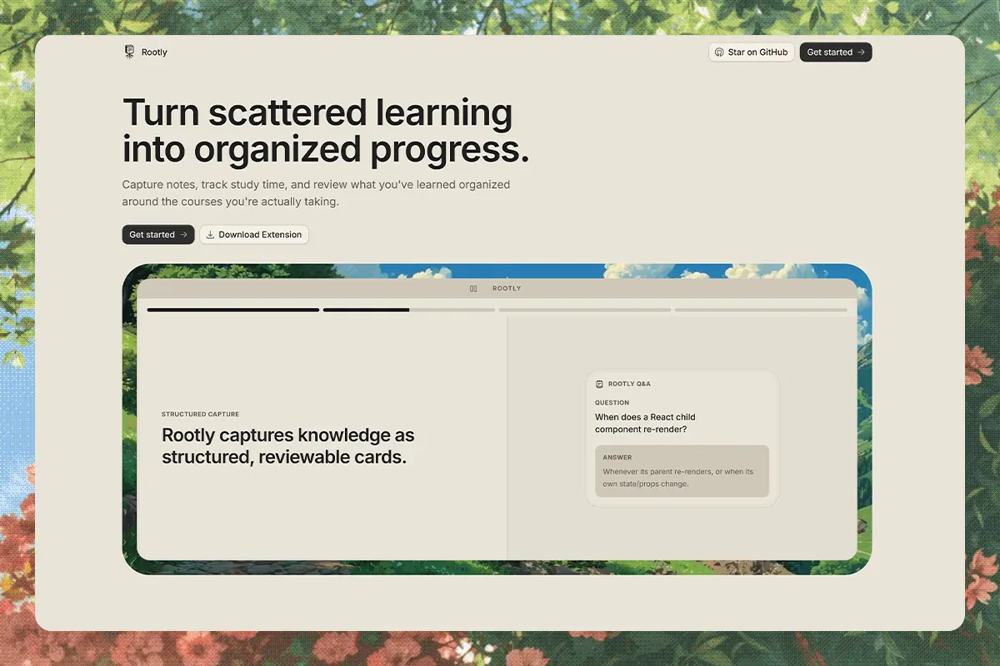

# Rootly

Rootly is a developer-focused learning notebook for self-taught developers and serious learners. It helps turn scattered study sessions into structured notes, reviewable knowledge, and measurable progress.

Rootly is built for active learning rather than generic note-taking. Capture what you learn, connect it to courses, record study time and mood, revisit it through active recall, and use the overview to see how your learning is developing.

## What you can do

- Capture two kinds of notes: Q&A notes for active recall and freeform notes for flexible study capture.
- Organize notes into courses while keeping uncategorized notes available.
- Log daily study time and mood to build a consistent learning record.
- Run review sessions that update understanding levels over time.
- Use overview charts and summaries to follow study trends, consistency, and mastery.
- Capture notes and daily entries from a browser side panel without leaving the page you are studying.

## Product surface

| Surface           | Purpose                                                           |
| ----------------- | ----------------------------------------------------------------- |
| Marketing site    | Explains the product and its learning workflow                    |
| Dashboard         | Houses overview, notes, courses, daily entries, and review        |
| Browser extension | Provides fast side-panel capture connected to the website session |
| Supabase backend  | Stores user-scoped learning data and authentication state         |

Authenticated dashboard routes include `/overview`, `/notes`, `/courses`, `/courses/[id]`, `/daily-entries`, and `/review`. Public routes include `/`, `/login`, `/terms`, and `/privacy`.

## Architecture

Rootly is the v2 cloud-first rebuild of the product:

- Next.js App Router separates marketing, authentication, and dashboard route groups.
- The shared `DashboardShell` mounts once in `app/(dashboard)/layout.tsx`.
- Supabase Auth and Row Level Security keep reads and writes scoped to the signed-in user.
- `proxy.ts` refreshes sessions and protects dashboard routes.
- Next.js Cache Components, cache lifetimes, cache tags, and targeted invalidation support fresh dashboard reads.
- TanStack Query powers interactive dashboard areas such as notes, courses, daily entries, and review.
- The browser extension uses the website cookie session rather than a separate token system.
- Coss UI components in `components/ui` are treated as a sealed design-system boundary.

## Technology

- Next.js 16 and React 19
- TypeScript and Tailwind CSS v4
- Supabase Auth and PostgreSQL
- TanStack Query
- Coss UI on Base UI
- Motion and Recharts
- Oxlint and Oxfmt
- Chrome Manifest V3 extension APIs

## Run locally

Requirements: Node.js, pnpm, and a Supabase project.

Install dependencies and start the development server:

```bash
pnpm install
pnpm dev
```

Open [http://localhost:3000](http://localhost:3000).

Create `.env.local` with the values required by the application:

```env
NEXT_PUBLIC_SUPABASE_URL=https://your-project-id.supabase.co
NEXT_PUBLIC_SUPABASE_PUBLISHABLE_KEY=sb_publishable_your_key_here
NEXT_PUBLIC_SITE_URL=http://localhost:3000

SUPABASE_SECRET_KEY=sb_secret_your_key_here
SUPABASE_PROJECT_ID=your-project-id
SUPABASE_DB_PASSWORD=your-db-password

# Optional: protects /api/beacon
BEACON_SECRET=replace-with-a-long-random-string
```

The complete variable list is also available in [.env.example](.env.example). Server-only secrets must not be exposed to the browser.

## Browser extension

The extension lives in [extension](extension). It is a Manifest V3 side panel that can use the local app or the configured Rootly site. Sign in to Rootly in the browser first, then load the `extension` directory as an unpacked extension in Chrome.

The side panel connects to these website API routes:

- `GET /api/extension/bootstrap`
- `POST /api/extension/notes`
- `POST /api/extension/courses`
- `POST /api/extension/daily-entries`

Extension writes include payload normalization and idempotency handling. Dashboard live-update bridges keep relevant notes and daily entries visible after an extension write.

## Development commands

```bash
pnpm dev             # Start Next.js with Turbopack
pnpm build           # Create a production build
pnpm start           # Serve the production build
pnpm typecheck       # Run TypeScript checks
pnpm lint            # Run Oxlint with warnings denied
pnpm fmt:check       # Check Oxfmt formatting
pnpm test:extension  # Run extension and idempotency tests
```

## Repository map

- [app](app): App Router routes, server actions, and feature UIs
- [components](components): shared shell, providers, and UI primitives
- [extension](extension): Manifest V3 side panel and browser bridges
- [hooks](hooks): reusable client hooks
- [lib](lib): Supabase clients, caching, live updates, themes, audio, and extension helpers
- [spec](spec): product direction and implementation guidance
- [docs](docs): Coss UI, Supabase, theme, and interaction references

## Project rules

Rootly is intentionally a learning notebook, not a general-purpose workspace. New work should strengthen structured capture, active recall, or measurable progress without expanding the product into a generic notes or collaboration platform.

Treat [components/ui](components/ui) as owned design-system code: compose existing primitives and preserve their established tokens and interaction conventions.

For the product model and architectural constraints, read [spec/index.md](spec/index.md). The repository's skill index is in [spec/skills.md](spec/skills.md).

## Supabase beacon

The optional `/api/beacon` endpoint records a small heartbeat for keeping an otherwise quiet Supabase project active. Its table definition is in [docs/supabase-beacon.sql](docs/supabase-beacon.sql), and the client-side throttled request is wired through [components/beacon-client.tsx](components/beacon-client.tsx).

## Status

This repository is the active v2 application codebase. The implementation and configuration are the source of truth for shipped behavior; product intent and non-negotiable constraints are recorded in [spec/index.md](spec/index.md).
